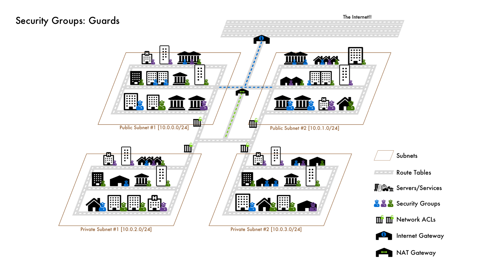

# Core Production Infrastructure on AWS with Terraform

This repo is an educational walkthrough of the core building blocks used to stand up production infrastructure on [Amazon Web Services](https://aws.amazon.com/) with [HashiCorp Terraform](https://www.terraform.io/).  The focus is on Networking via [Virtual Private Clouds (VPC)](https://docs.aws.amazon.com/vpc/latest/userguide/what-is-amazon-vpc.html) and Compute via [Elastic Compute Cloud (EC2)](https://docs.aws.amazon.com/AWSEC2/latest/UserGuide/concepts.html).

Ultimately, every component in a cloud infrastructure is a server running some software on a network.  Therefore understanding the two primary pieces, Networking (VPC) and Compute (EC2), is essential to gaining flexibility in building and maintaining your own environments.

## How to Use This Repo

This repo contains 10 branches representing different states of a baseline production infrastructure using only the bare essentials - servers and a network.  The first branch contains nothing but scaffolding, the last branch the full network and servers, while everything else in between is the work-in-progress.  Each branch also contains an image that draws an analogy between servers and networking to building a city.

Everything is written using Infrastructure as Code via Terraform so that you can easily deploy and destroy the project.  Additionally, to customize and repurpose this infrastructure for your own projects you'd need to:

- Rewrite the [`private.sh`](files/private.sh) and [`public.sh`](files/public.sh) scripts to install your software and dependencies.
- Modify the [Load Balancer](ec2-lb.tf) and [Target Groups](ec2-lb.tf) to point to the right ports for your software.
- Modify the [Security Groups](security-groups.tf) to allow for correct port openings between your servers.
- Front your [Load Balancer's with a TLS certificate](https://docs.aws.amazon.com/elasticloadbalancing/latest/application/create-https-listener.html).

## The Architecture Analogy

The Different States in Descending Order:

1. [AWS Account: Landmass](https://github.com/jcolemorrison/core-production-infrastructure-aws-terraform/tree/part-1)
2. [VPC Network: The City](https://github.com/jcolemorrison/core-production-infrastructure-aws-terraform/tree/part-2)
3. [VPC Subnets: Districts](https://github.com/jcolemorrison/core-production-infrastructure-aws-terraform/tree/part-3)
4. [Route Tables: Roads](https://github.com/jcolemorrison/core-production-infrastructure-aws-terraform/tree/part-4)
5. [Internet Gateway: Highway On-Ramp](https://github.com/jcolemorrison/core-production-infrastructure-aws-terraform/tree/part-5)
6. [NAT Gateway: Connection to On-Ramp](https://github.com/jcolemorrison/core-production-infrastructure-aws-terraform/tree/part-6)
7. [Network ACLs: District Gates](https://github.com/jcolemorrison/core-production-infrastructure-aws-terraform/tree/part-7)
8. [Servers and Services: Buildings](https://github.com/jcolemorrison/core-production-infrastructure-aws-terraform/tree/part-8)
9. [Security Groups: Security Guards](https://github.com/jcolemorrison/core-production-infrastructure-aws-terraform/tree/part-9)
10. [AutoScaling Groups and Load Balancers: Franchises and Info Booths](https://github.com/jcolemorrison/core-production-infrastructure-aws-terraform/tree/part-10)

The [Master Branch](https://github.com/jcolemorrison/core-production-infrastructure-aws-terraform) represents the final state of the repo and is equivalent to #10 from above.

## Getting Started

### Prerequisites

1. Have an [AWS Account](https://aws.amazon.com/).

2. Install [HashiCorp Terraform](https://www.terraform.io/downloads).

3. Have the [AWS CLI Installed](https://docs.aws.amazon.com/cli/latest/userguide/getting-started-install.html).

4. Create an [AWS IAM User](https://docs.aws.amazon.com/IAM/latest/UserGuide/getting-started_create-admin-group.html) with Admin or Power User Permissions.
  - this user will only be used locally

5. [Configure the AWS CLI](https://docs.aws.amazon.com/cli/latest/userguide/cli-chap-configure.html) with the IAM User from Step 4.
  - Terraform will read your credentials via the AWS CLI Profile
  - [Other Authentication Methods with AWS and Terraform](https://registry.terraform.io/providers/hashicorp/aws/latest/docs#authentication)

6. Create an [EC2 Key Pair](https://docs.aws.amazon.com/AWSEC2/latest/UserGuide/ec2-key-pairs.html) so that you can access your public servers.
  - This is for debugging.  Best practice would be to set up a bastion (aka jump box) and only allow SSH access onto your public / private servers from that.

### Using this Code Locally

1. Clone this repo to an empty directory.

2. Run `terraform init` to initialize the project and pull down modules.

3. Run `terraform plan` to see what resources will be created.

4. Run `terraform apply` to create the infrastructure on AWS!

5. Navigate to the `service_endpoint` output by Terraform to see the live service.

6. When finished, run `terraform destroy` to destroy the infrastructure.
